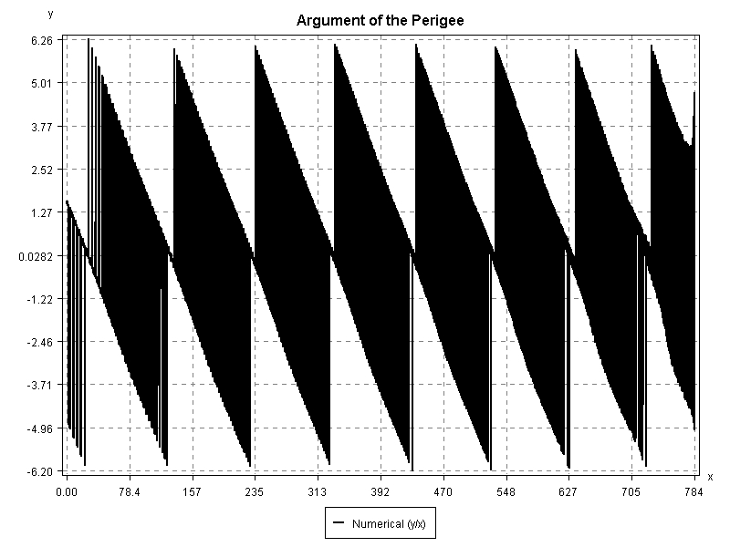

This is Tolosat's Orekit project.

## Plotting test

## License

Orekit tutorials are licensed by [CS GROUP](https://www.csgroup.eu/) under
the [Apache License, version 2.0](http://www.apache.org/licenses/LICENSE-2.0.html).
A copy of this license is provided in the [LICENSE.txt](LICENSE.txt) file.
